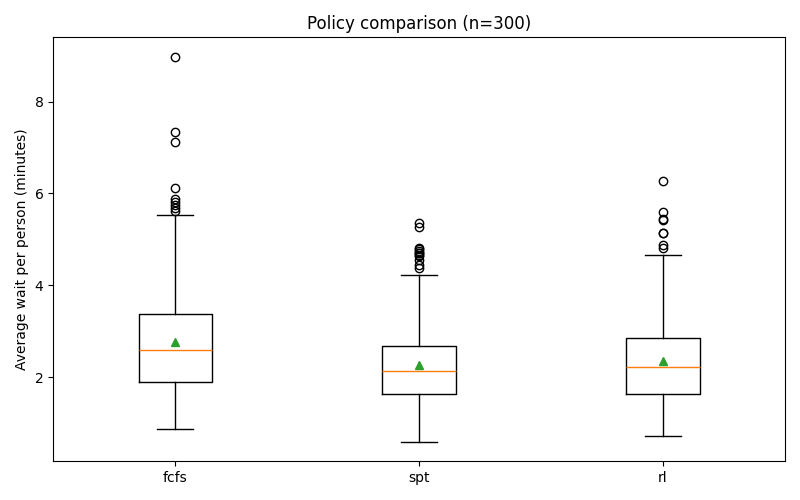

# Leo Radočaj

# Projekt raspoređivanja narudžbi u restoranu (McDonalds)

## Pregled

Ovaj projekt simulira red narudžbi u restoranu brze hrane i uspoređuje različite strategije raspoređivanja za posluživanje
narudžbi. Glavni cilj je koristiti (Reinforcement Learning, RL) kako bi se naučila učinkovita strategija posluživanja
narudžbi i usporedila s dvjema klasičnim heuristikama:

- **FCFS (First-Come, First-Served)**
- **SPT (Shortest Processing Time)**

RL agent se trenira kako bi minimizirao prosječno vrijeme čekanja po narudžbi, a njegovi rezultati se vizualiziraju i
uspoređuju s heuristikama.

## Glavne Komponente

- `env.py`: Definira simulacijsko okruženje, strukturu narudžbi i oblikovanje nagrada za RL.
- `agent.py`: Implementira DQN agent koristeći TensorFlow/Keras.
- `train.py`: Treniranje RL agenta i spremanje konačnih weightsa modela.
- `compare.py`: Pokreće usporedbe strategija i ispisuje statistike performansi te grafikone.
- `requirements.txt`: Popis potrebnih Python paketa.

## Kako Funkcionira

1. **Simulacija**: Narudžbe dolaze nasumično, svaka s 1–3 artikla (hamburger, piće, sladoled). Svaki artikl ima
   stohastičko vrijeme posluživanja.
2. **Stragegije/Heuristike**:
    - **FCFS**: Uvijek poslužuje najstariju dostupnu narudžbu.
    - **SPT**: Poslužuje narudžbu s najkraćim očekivanim ukupnim vremenom posluživanja.
    - **RL**: Koristi istreniranog DQN agenta za odabir koje će se narudžbe poslužiti sljedeće.
3. **Trening**: RL agent se trenira kroz mnogo epizoda kako bi minimizirao vrijeme čekanja, koristeći nagradu oblikovanu
   tako da potiče ponašanje slično SPT-u.
4. **Evaluacija**: Nakon treninga, sve tri strategije se pokreću kroz mnogo epizoda. Prosječna vremena čekanja i broj
   posluženih narudžbi se bilježe i vizualiziraju.

## Izlaz

- **Boxplot usporedba**: Glavni izlaz je boxplot (`results/policy_boxplot.png`) koji prikazuje distribuciju prosječnog
  vremena čekanja za svaku strategiju kroz mnogo epizoda. Primjer:
    - Niže prosječno vrijeme čekanja ukazuje na bolje performanse.
    - Iznimke i raspon pokazuju konzistentnost i robusnost.
- **Logovi**: Nakon pokretanja `compare.py`, ispisuju se statistike poput:
  ```
    fcfs: mean_wait=0.205, std_wait=0.067, served_orders_mean=161.2
    spt: mean_wait=0.181, std_wait=0.051, served_orders_mean=161.3
    rl: mean_wait=0.196, std_wait=0.062, served_orders_mean=160.8
  ```



## Interpretacija

**SPT**  ima najniže srednje i prosječno vrijeme čekanja, što pokazuje da je najučinkovitiji u minimiziranju čekanja.  
**FCFS** i RL imaju slične performanse, pri čemu je RL malo bolji od FCFS-a, ali još uvijek slabiji od SPT-a.

SPT je najbolja strategija za minimiziranje prosječnog vremena čekanja.
RL agent postiže rezultate slične FCFS-u, ali još ne nadmašuje SPT.
